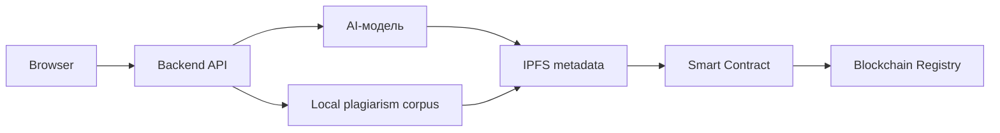

# EduProof AI

EduProof AI - децентрализованная платформа проверки учебных работ. Приложение объединяет AI-рецензирование, локальный антиплагиат, IPFS-like metadata, смарт-контракт `EduProofCertificate` и NFT-сертификаты подлинности.

Главная идея проекта: результат проверки должен быть не только виден в интерфейсе, но и проверяем независимо. Для этого в реестр записываются хеш работы, хеш AI-отчета, metadata URI, итоговый score, issuer и статус сертификата. Полный текст работы не публикуется в блокчейне.

**Подготовили студентки группы МПМ-25-1 Варламова Елизавета Ивановна и Кибиткина Полина Витальевна**

## Что реализовано

- Удобный UI для загрузки учебной работы, AI-проверки и NFT-предпросмотра.
- Ролевая модель: студент, преподаватель / issuer, проверяющий, администратор.
- Backend API на Node.js для анализа работы, IPFS-like metadata и mint-сценария.
- Локальный антиплагиат по корпусу источников из папки `corpus`.
- Поддержка локальной нейросети Ollama и OpenAI-compatible API.
- Fallback-оценка, если нейросеть недоступна.
- Экспорт AI-отчета в JSON.
- Реестр сертификатов и проверка по `Token ID` или хешу работы.
- Solidity-контракт `EduProofCertificate.sol` для soulbound NFT-сертификатов.
- Интеграция с Truffle/Ganache и fallback registry, если Ganache не запущен.
- Ganache status, contract status и chain diagnostics в интерфейсе.

## Запуск после копирования репозитория

Эти шаги подходят для человека, который впервые скачал проект с GitHub или получил папку проекта.

### 1. Установить базовые инструменты

Нужно установить:

- Node.js 18 или новее;
- Git, если проект клонируется через `git clone`;
- Ganache, если нужно показать реальный локальный blockchain mint;
- Ollama, если нужно показать локальную нейросеть.

Проверка Node.js:

```powershell
node -v
npm -v
```

### 2. Скопировать проект

Если проект клонируется из GitHub:

```powershell
git clone https://github.com/aodiern/EduProofAI.git
cd eduproof-ai
```

Если проект скачан ZIP-архивом, нужно распаковать архив и открыть терминал в папке `eduproof-ai`.

### 3. Установить зависимости

```powershell
npm install
```

Это установит Truffle и зависимости для работы со смарт-контрактом. Основной backend написан на стандартных модулях Node.js, но `npm install` все равно нужен для полноценного запуска проекта из репозитория.

### 4. Запустить приложение

```powershell
npm start
```

или:

```powershell
node server.js
```

После запуска открыть в браузере:

```text
http://localhost:4183
```

Если порт занят, можно указать другой:

```powershell
$env:PORT="4200"
npm start
```

Тогда открыть:

```text
http://localhost:4200
```

### 5. Быстрая проверка без нейросети и Ganache

Проект можно запустить сразу после `npm install`. Даже если Ollama и Ganache не установлены, приложение работает в fallback-режиме:

- AI-проверка заменяется локальной эвристикой;
- антиплагиат работает по локальному корпусу `corpus`;
- IPFS metadata сохраняется локально в `storage/ipfs`;
- NFT-запись сохраняется в fallback registry.

Для просмотра:

1. Открыть `http://localhost:4183`.
2. Выбрать роль `Преподаватель / issuer`.
3. Нажать `Пример`.
4. Нажать `Проверить работу`.
5. Нажать `Выпустить NFT-сертификат`.
6. Перейти в `Реестр` и проверить запись по `Token ID`.

### 6. Проверка кода

```powershell
npm run check
```

Команда проверяет синтаксис основных JS-файлов.

## Ролевая модель

В MVP роль выбирается в UI и сохраняется в `localStorage`, чтобы удобно показать сценарии на защите. Это демонстрационная логика, а не production-авторизация.

Для production роль должна подтверждаться backend-авторизацией, подписью кошелька и смарт-контрактом.

| Роль | Ответственность |
| --- | --- |
| Студент | Загружает работу, запускает AI-проверку, смотрит score, антиплагиат и рекомендации. |
| Преподаватель / issuer | Подтверждает результат и выпускает NFT-сертификат. В контракте этому соответствует `onlyIssuer`. |
| Проверяющий | Проверяет уже выпущенный сертификат по `Token ID` или хешу без доступа к полному тексту работы. |
| Администратор | Управляет демо-состоянием, issuer-логикой, политиками и параметрами проекта. В контракте ближайший аналог - `owner`. |

## Как работает проверка

1. Пользователь отправляет работу через браузерный интерфейс.
2. `app.js` вызывает endpoint `/api/analyze-work`.
3. `server.js` считает `workHash` и запускает локальный антиплагиат.
4. Антиплагиат разбивает текст на шинглы по 5 слов и сравнивает их с локальным корпусом.
5. Если доступна Ollama или OpenAI-compatible модель, нейросеть формирует AI-рецензию.
6. Если нейросеть недоступна, включается локальная эвристическая оценка.
7. Backend сохраняет metadata отчета в `storage/ipfs` и возвращает `ipfs://...` URI.
8. Если score не ниже `70/100`, issuer может выпустить NFT-сертификат.
9. Backend вызывает Truffle/Ganache contract mint.
10. Если Ganache недоступен, результат сохраняется в локальный fallback registry.

## Архитектура



Основной pipeline:

```text
Браузер -> Backend API -> AI-модель -> IPFS -> Smart Contract -> Blockchain Registry
```

В демо-версии часть инфраструктуры работает локально:

- `storage/ipfs/*.json` - metadata AI-отчетов;
- `storage/chain/blockchain-registry.json` - fallback blockchain registry;
- `contracts/EduProofCertificate.sol` - Solidity-контракт;
- `truffle-config.js` и `migrations/` - деплой контракта в Ganache.

## Экономика EDP

`EDP` - utility-токен платформы. Он нужен для оплаты AI-проверки, выпуска NFT-сертификата и доступа к API-верификации.

Распределение комиссии:

```text
35% burn
40% validators
25% treasury
```

Почему так:

- `35% burn` уменьшает обращающееся предложение EDP и связывает спрос на проверки с дефляционной механикой.
- `40% validators` мотивирует участников поддерживать корректность реестра и доступность metadata.
- `25% treasury` остается в казне проекта для развития AI-моделей, серверов, IPFS-хранения, аудита и интеграций с вузами.

В UI экономика показана как демонстрационная модель. Она объясняет механику проекта, но не является финансовым прогнозом.

## Smart Contract

Контракт находится в:

```text
contracts/EduProofCertificate.sol
```

Он хранит:

- хеш студента;
- хеш работы;
- хеш AI-отчета;
- название работы;
- metadata URI;
- итоговый score;
- адрес issuer;
- дату выпуска;
- статус отзыва сертификата.

Сертификат сделан soulbound: функции передачи NFT заблокированы. Это важно, потому что учебный сертификат должен принадлежать конкретному автору и не должен продаваться или передаваться другому человеку.

## Запуск с Ollama

1. Установить Ollama.
2. Скачать модель:

```powershell
ollama pull qwen2.5:7b
```

3. Запустить проект:

```powershell
$env:AI_PROVIDER="ollama"
$env:OLLAMA_MODEL="qwen2.5:7b"
node server.js
```

Для более слабого компьютера можно использовать:

```powershell
ollama pull qwen2.5:3b
$env:OLLAMA_MODEL="qwen2.5:3b"
```

## Запуск с OpenAI-compatible API

```powershell
$env:AI_PROVIDER="openai"
$env:OPENAI_API_KEY="ваш_api_ключ"
$env:OPENAI_MODEL="gpt-4o-mini"
node server.js
```

API-ключ хранится только на сервере. Браузер отправляет запрос в локальный endpoint `/api/analyze-work`.

## Ganache / Truffle

1. Установить зависимости:

```powershell
cmd /c npm install
```

2. Открыть Ganache:

```text
Host: 127.0.0.1
Port: 7545
```

3. Задеплоить контракт:

```powershell
cmd /c npm run contract:migrate
```

4. Запустить backend:

```powershell
$env:CHAIN_MODE="truffle"
$env:TRUFFLE_PROJECT_DIR="."
$env:TRUFFLE_NETWORK="development"
$env:ETH_RPC_URL="http://127.0.0.1:7545"
node server.js
```

После этого кнопка `Выпустить NFT-сертификат` будет пытаться вызвать реальный метод контракта:

```solidity
mintCertificate(
  studentWallet,
  studentHash,
  workHash,
  aiReportHash,
  title,
  metadataURI,
  scoreBps
)
```

## Корпус антиплагиата

Демонстрационный корпус находится в:

```text
corpus/academic-sources.json
```

Можно добавлять:

- JSON-файлы с массивом `sources`;
- TXT-файлы, где весь текст считается одним источником.

Пример JSON:

```json
{
  "sources": [
    {
      "id": "source-id",
      "title": "Название источника",
      "type": "article",
      "url": "local://source",
      "text": "Текст источника для сравнения."
    }
  ]
}
```
