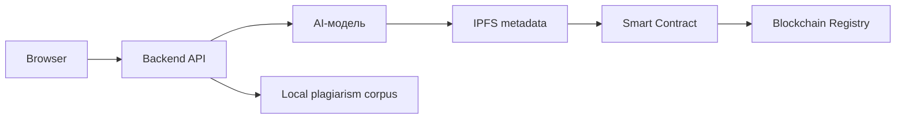

# EduProof AI

Децентрализованная платформа проверки учебных работ с AI-рецензированием, локальным антиплагиатом и NFT-сертификатами подлинности.

## Что реализовано

- Интерфейс подачи учебной работы: автор, вуз, тип работы, текст или файл TXT/MD/CSV/JSON.
- Локальный backend на Node.js без внешних npm-зависимостей.
- Локальный антиплагиат по корпусу источников в папке `corpus`.
- Поддержка локальной нейросети Ollama.
- Поддержка OpenAI-compatible API через серверный прокси.
- Резервная проверка без нейросети: если Ollama/OpenAI недоступны, сервер все равно считает совпадения и академические метрики.
- Выпуск демо NFT-сертификата в локальный реестр браузера.
- Проверка сертификата по `Token ID` или хешу работы.
- Solidity-контракт `EduProofCertificate.sol` для soulbound NFT-сертификатов.

## Как работает проверка

1. Пользователь отправляет работу через `index.html`.
2. `app.js` вызывает backend endpoint `/api/analyze-work`.
3. `server.js` разбивает текст на словесные шинглы по 5 слов.
4. Сервер сравнивает шинглы с локальным корпусом `corpus/*.json` и `corpus/*.txt`.
5. Сервер считает процент совпадений, процент уникальности и список похожих источников.
6. Если доступна Ollama или OpenAI-compatible модель, нейросеть интерпретирует результат и формирует рекомендации.
7. Если модель недоступна, включается локальная эвристическая оценка.
8. Backend сохраняет metadata отчета в локальный IPFS-like storage и возвращает `ipfs://...` URI.
9. При score не ниже `70/100` браузер вызывает `/api/mint-certificate`.
10. Backend вызывает Truffle-контракт `EduProofCertificate` в этом же репозитории. Если Ganache не запущен, включается локальный fallback registry.

## Архитектура



В демо-версии IPFS и blockchain registry реализованы локально:

- `storage/ipfs/*.json` - metadata отчета, доступная как `ipfs://...`;
- `storage/chain/blockchain-registry.json` - имитация публичного блокчейн-реестра;
- `contracts/EduProofCertificate.sol` - Solidity-реализация контракта.
- `truffle-config.js` и `migrations/` - настройка компиляции и деплоя контракта из этого же репозитория.

Если запущены Ganache и Truffle migration, backend вызывает настоящий контракт из текущей папки `eduproof-ai`. При ошибке сети или если контракт еще не задеплоен, backend автоматически использует локальный fallback registry.

## Экономика EDP

Utility-токен `EDP` используется для оплаты AI-проверки, выпуска сертификата и доступа к API верификации.

- `35%` комиссии сжигается.
- `40%` идет валидаторам.
- `25%` поступает в казначейство проекта.

Сжигание комиссии связывает спрос на проверки с уменьшением обращающегося предложения токена. Валидаторы получают мотивацию поддерживать корректность реестра и доступность metadata.

## Локальный запуск без нейросети

Можно открыть файл напрямую:

```text
index.html
```

В этом режиме будет работать клиентский fallback, но локальный корпус антиплагиата не подключается. Для полноценной проверки лучше запускать сервер.

## Запуск с локальным антиплагиатом

```powershell
cd "C:\Users\user\Documents\2 семестр магистратура\блокчейн\eduproof-ai"
node server.js
```

Открыть:

```text
http://localhost:4173
```

Даже без Ollama сервер выполнит локальный антиплагиат и резервную академическую оценку.

## Запуск с локальной нейросетью Ollama

1. Установить Ollama.
2. Скачать модель:

```powershell
ollama pull qwen2.5:7b
```

3. Запустить проект:

```powershell
cd "C:\Users\user\Documents\2 семестр магистратура\блокчейн\eduproof-ai"
$env:AI_PROVIDER="ollama"
$env:OLLAMA_MODEL="qwen2.5:7b"
node server.js
```

Для слабого компьютера можно использовать:

```powershell
ollama pull qwen2.5:3b
$env:OLLAMA_MODEL="qwen2.5:3b"
```

## Запуск с OpenAI-compatible API

```powershell
cd "C:\Users\user\Documents\2 семестр магистратура\блокчейн\eduproof-ai"
$env:AI_PROVIDER="openai"
$env:OPENAI_API_KEY="ваш_api_ключ"
$env:OPENAI_MODEL="gpt-4o-mini"
node server.js
```

API-ключ хранится только на сервере. Браузер отправляет запрос в локальный endpoint `/api/analyze-work`.

## Корпус антиплагиата

Демонстрационный корпус находится в:

```text
corpus/academic-sources.json
```

Можно добавлять:

- новые JSON-файлы с массивом `sources`;
- обычные TXT-файлы, где весь текст считается одним источником.

Формат JSON:

```json
{
  "sources": [
    {
      "id": "source-id",
      "title": "Название источника",
      "type": "article",
      "url": "local://source",
      "text": "Текст источника для сравнения."
    }
  ]
}
```

## Смарт-контракт

Контракт находится в:

```text
contracts/EduProofCertificate.sol
```

Он хранит:

- хеш студента;
- хеш работы;
- хеш AI-отчета;
- итоговый score;
- адрес вуза-эмитента;
- URI metadata;
- статус отзыва сертификата.

Сертификат сделан soulbound: функции передачи NFT заблокированы.

## Подключение к Ganache / Truffle

Вся blockchain-часть теперь находится в этом же репозитории `eduproof-ai`.

1. Установите зависимости, если Truffle еще не установлен:

```powershell
cd "C:\Users\user\Documents\2 семестр магистратура\блокчейн\eduproof-ai"
cmd /c npm install
```

2. Откройте Ganache:

```text
Host: 127.0.0.1
Port: 7545
```

3. Задеплойте контракт:

```powershell
cd "C:\Users\user\Documents\2 семестр магистратура\блокчейн\eduproof-ai"
cmd /c npm run contract:migrate
```

Если нужно запустить Truffle напрямую:

```powershell
cmd /c npx truffle migrate --reset --network development
```

4. Запустите EduProof backend:

```powershell
cd "C:\Users\user\Documents\2 семестр магистратура\блокчейн\eduproof-ai"
$env:CHAIN_MODE="truffle"
$env:TRUFFLE_PROJECT_DIR="."
$env:TRUFFLE_NETWORK="development"
$env:ETH_RPC_URL="http://127.0.0.1:7545"
node server.js
```

После этого кнопка `Выпустить NFT-сертификат` будет пытаться вызвать реальный метод:

```solidity
mintCertificate(
  studentWallet,
  studentHash,
  workHash,
  aiReportHash,
  title,
  metadataURI,
  scoreBps
)
```

## Демонстрация на защите

1. Запустить `node server.js`.
2. Открыть `http://localhost:4173`.
3. Нажать `Пример`.
4. Нажать `Проверить работу`.
5. Показать AI-отчет, процент совпадений и найденные источники.
6. Нажать `Выпустить NFT-сертификат`.
7. В разделе `Реестр` проверить сертификат по `Token ID`.
8. Показать вкладки `Экономика`, `Архитектура`, `Roadmap`.
